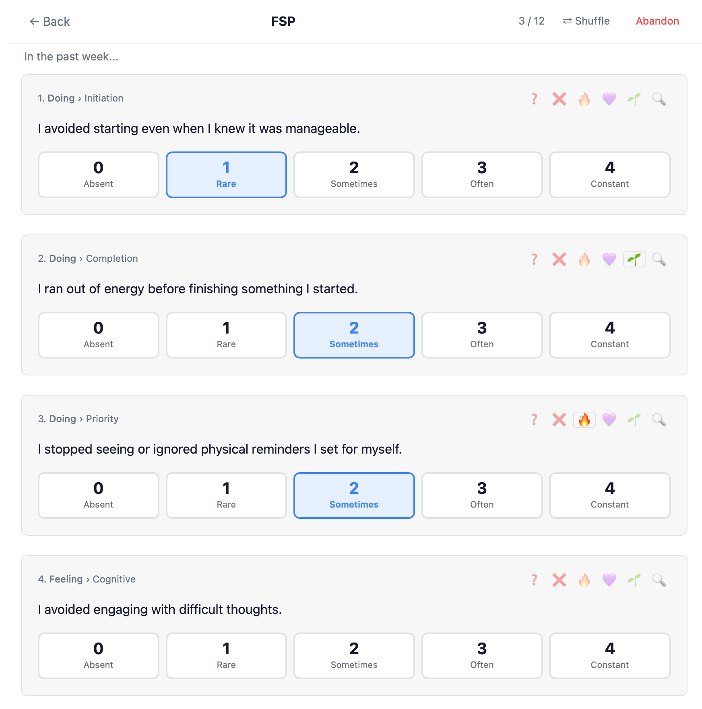
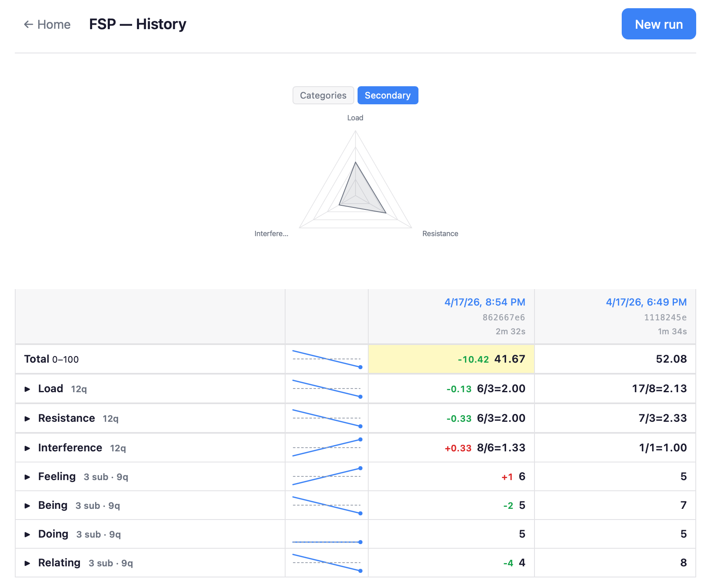
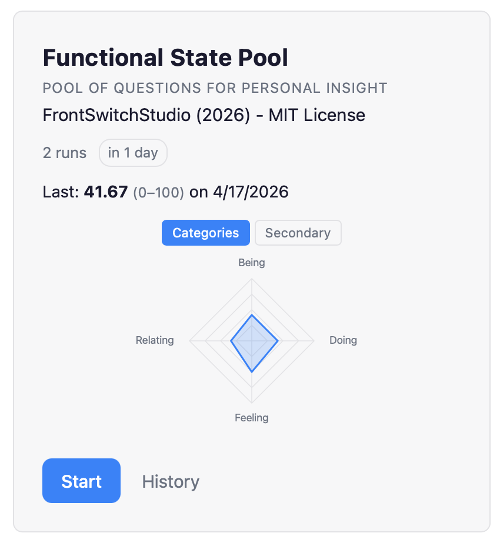

# Dissociative System Witness

A local, private psychology assessment tracker. Run structured assessments, watch your scores change over time, and annotate questions that stand out with emotes.

Customize question wording to match what means something to you. No server, no account, no data leaves your machine. The database is a plain SQLite file you own.

DISCLAIMER: This tool is a personal data collection project for self-observation. It is NOT a diagnostic tool, medical device, or substitute for professional clinical advice. Use at your own risk.
---

## Releases

### Version v1.0.1

The first release is available. Calling it "Early Access." Let me know what you find!

[open an issue](https://github.com/FrontSwitch/ds-witness/issues)

<table width="100%">
  <tr>
    <td width="33%"></td>
    <td width="33%"></td>
    <td width="33%"></td>
  </tr>
  <tr>
    <td align="center">Run an assessment</td>
    <td align="center">View history</td>
    <td align="center">Summary card</td>
  </tr>
</table>

--- 
## Running it

```bash
npm install
npm run tauri:dev     # native app (first run compiles Rust, ~60s)
npm run tauri:build   # build distributable .app
```

If port 5173 is busy: `lsof -ti :5173 | xargs kill -9`

Browser-only (no Tauri, data goes to IndexedDB):
```bash
npm run dev    # http://localhost:5173
```

---

## Assessments included

| ID | Name | Scale |
|----|------|-------|
| `fsp` | FrontSwitch Functional Scale Pool (36 items pick 12) | 0-100 |
| `phq-9` | Patient Health Questionnaire-9 | 0–27 |
| `gad-7` | Generalized Anxiety Disorder-7 | 0–21 |
| `ffmq-15` | Five Facet Mindfulness Questionnaire (15-item) | 0–60 |


---

## Taking an assessment

Start a new run from the home screen or resume an in-progress one. Questions reveal one at a time; previous answers are always editable.

**Dormant** (on by default) — hides questions that scored 0 in each of the last two completed runs. 10% of dormant questions rotate back in each run, seeded consistently by run ID. Questions flagged `anchor` in the data file are always shown.

**Shuffle** — randomises question order, consistent per run.

**Emotes** — mark individual questions. Multiple can be active at once.

| Emoji | Meaning |
|-------|---------|
| ❓ | Uncertain about the answer |
| ❌ | Doesn't apply |
| 🔥 | Significant |
| 💜 | Resonates |
| 🌱 | Improving |
| 🔍 | Curious about this |

Emotes are stored per question per run and shown in the history table (subclass rows show the union across their questions for that run).

---

## Assessment versioning

Every run is tagged at creation with an 8-character hash of the question set active at that time. When questions are later reworded or retired, older runs keep their original snapshot and continue to score correctly — the history table will show different version hashes when a question set changed between runs.

**Editing the question files:**

| Change | What to do |
|--------|-----------|
| Wording tweak | Edit the text. New hash minted on next run; old runs unaffected. |
| Intent change | Assign a new ID. Mark the old ID `obsolete`. |
| Retiring a question | Add `obsolete` to its flags. It disappears from new runs; old runs still score it. |
| New question | Add with a new unique ID. Gaps in IDs are fine. |

---

## Importing historical data

From the home screen click **Import data**. Paste a table with the first row as a header (`id` followed by ISO dates), then one row per question:

```
id|2023-06-01|2023-09-15|2024-01-10
3|2|1|3
36|1|0|2
39|0|0|1
```

Enable **Remap 0–10 → 0–4** if your historical data used a 0–10 scale. Unknown question IDs are rejected immediately.

---

## Adding your own assessment

1. Create `public/data/<name>.psv`:

   ```
   # Comments start with #
   id|category|subclass|flags|question text
   1|Category|Subclass||Question text here
   2|Category|Subclass|anchor|Always shown, never dormant
   3|Category|Subclass|reverse|Scored as 4 − raw
   ```

2. Edit meta data. See the other psv files for examples.

**PSV metadata** — `# @key: value` comment lines at the top of each PSV file, parsed into `DatasetMeta`:
- `@title` — full display name
- `@tagline` — short descriptor shown on home card
- `@frequency` — target days between runs (drives "take now" / "in N days" badge)
- `@max` — displayed scale ceiling (e.g. 100, 27, 21)
- `@normalize` — canonical question count used as divisor for normalized scoring (e.g. 162, 60); omit for raw sum
- `@item-max` — per-question max value (default 4); used in reverse scoring and normalized formula
- `@secondary: flag=Label` — declares a secondary score group; one line per group. Questions get the flag in their flags field. Repeatable for multiple groups.   

3. Add record to `public/data/datasets.json`

---

## Data

Native app database:
```
~/Library/Application Support/com.frontswitchstudio.dsw/dsw.sqlite
```

Standard SQLite — back up with Time Machine, copy between machines, or open in any SQLite viewer.

Distributable app:
```bash
npm run tauri:build
# → src-tauri/target/release/bundle/macos/Dissociative System Witness.app
```
